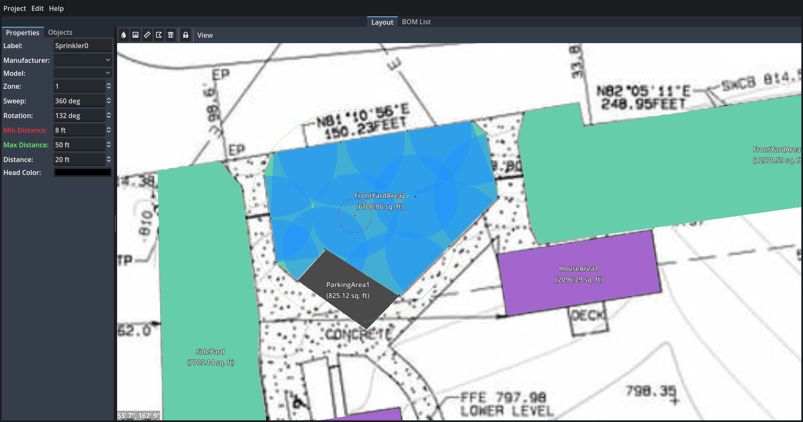

# Yardscaper

**Yardscaper** is a cross-platform 2D yard design tool, built with the [Godot Game Engine](https://godotengine.org/). It’s ideal for planning sprinkler layouts, measuring areas, and drafting basic landscape designs.



## 🚀 Download

Get the latest version on the [Releases page](https://github.com/hankedan000/yardscaper/releases).

## ✨ Features

- **Cross-platform**  
  Runs on **Linux** and **Windows** (macOS support coming soon)

- **Multi-project support**  
  Open and switch between multiple yard designs easily

- **Image import & scaling wizard**  
  Bring in site or survey photos and scale them to real-world measurements

- **Sprinkler system tools**  
  Place sprinkler heads and customize:
  - Sweep angle
  - Rotation
  - Spray distance

- **Polygon shape tool**  
  Draw shapes and measure square footage

- **Linear distance tool**  
  Easily measure distances between points

- **Export to image**  
  Save your designs as `.png`, `.jpg`, or `.webp`

---

## 🛠 Getting Started (Dev Setup)

To run Yardscaper from source:

1. Clone this repository:
    ```git clone https://github.com/hankedan000/yardscaper.git```

2. Open the Godot editor.

3. In Godot, open the project located in the `Yardscaper/` directory in the repo.

4. Run the project or make your changes.

## Requirements

- [Godot Engine 4.3](https://godotengine.org/download/archive/4.3-stable/)

---

## 🤝 Contributing

Contributions are welcome! If you'd like to help out:

- Open a [GitHub Issue](https://github.com/hankedan000/yardscaper/issues) to report bugs or suggest new features

- Submit a pull request with improvements or fixes

- Star the repo to show support ⭐

---

## 📫 Feadback & Support

Have ideas or find a bug? Please [create an issue](https://github.com/hankedan000/yardscaper/issues) — your feedback helps make Yardscaper better for everyone!
