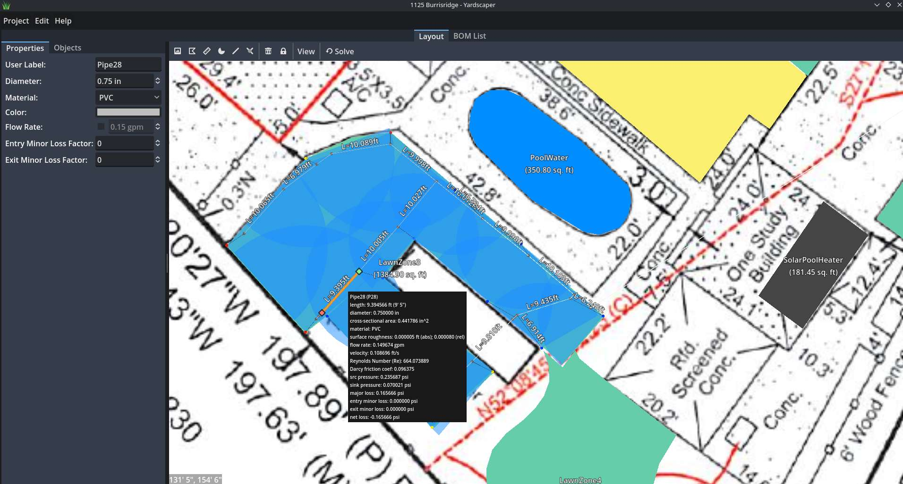

# Yardscaper

**Yardscaper** is a 2D sprinkler system design tool with built-in fluid simulation. Plan out full irrigation layouts using pipes, connectors, and sprinkler heads, then simulate water flow to calculate pressures, flow rates, and head losses throughout your system. It's built with the [Godot Game Engine](https://godotengine.org/), and also includes tools for general yard planning—such as area measurement, shape drawing, and photo-based scaling.



## 🚀 Download

Get the latest version on the [Releases page](https://github.com/hankedan000/yardscaper/releases).

## ✨ Features

- **Sprinkler system design**  
  Place sprinkler heads, pipes, and connectors
  - Sprinkle properties: sweep angle, rotation, spray distance
  - Pipe properties: length, diameter, material

- **Fluid system solver**  
  Simulate water flow through your design to compute:
  - Pressure at each connection
  - Flow rates in all pipes
  - Major and minor head losses

- **Cross-platform**  
  Runs on **Linux** and **Windows** (macOS support coming soon)

- **Multi-project support**  
  Open and switch between multiple yard designs easily

- **Image import & scaling wizard**  
  Bring in site or survey photos and scale them to real-world measurements

- **Polygon shape tool**  
  Draw shapes and measure square footage

- **Linear distance tool**  
  Easily measure distances between points

- **Export to image**  
  Save your designs as `.png`, `.jpg`, or `.webp`

---

## 🛠 Getting Started (Dev Setup)

To run Yardscaper from source:

1. Clone this repository:
    ```git clone https://github.com/hankedan000/yardscaper.git```

2. Open the Godot editor.

3. In Godot, open the project located in the `Yardscaper/` directory in the repo.

4. Run the project or make your changes.

## Requirements

- [Godot Engine 4.3](https://godotengine.org/download/archive/4.3-stable/)

---

## 🤝 Contributing

Contributions are welcome! If you'd like to help out:

- Open a [GitHub Issue](https://github.com/hankedan000/yardscaper/issues) to report bugs or suggest new features

- Submit a pull request with improvements or fixes

- Star the repo to show support ⭐

---

## 📫 Feadback & Support

Have ideas or find a bug? Please [create an issue](https://github.com/hankedan000/yardscaper/issues) — your feedback helps make Yardscaper better for everyone!
